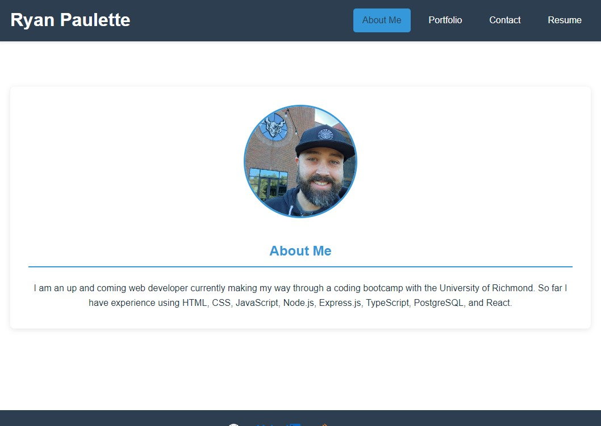
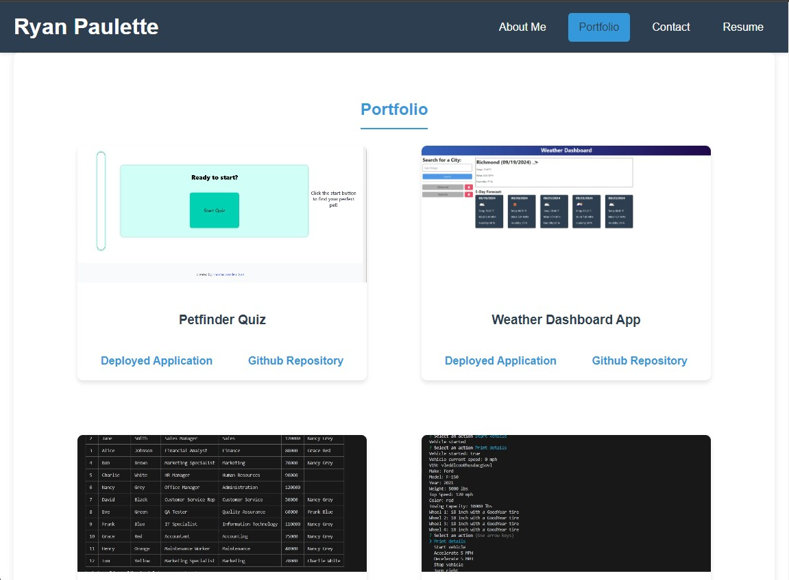
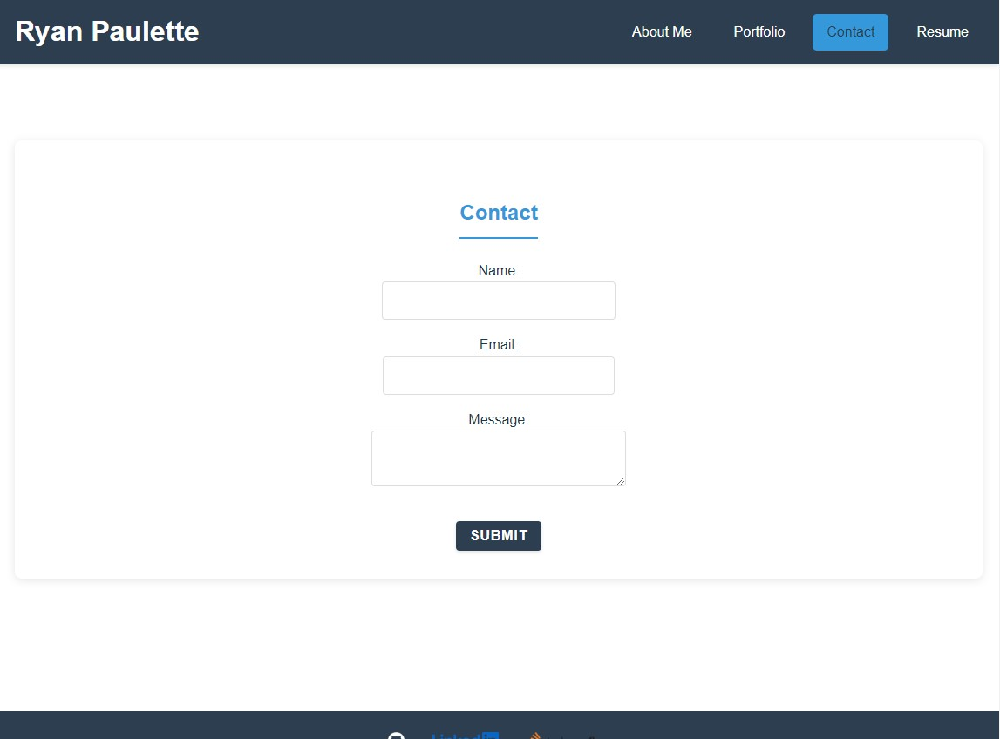
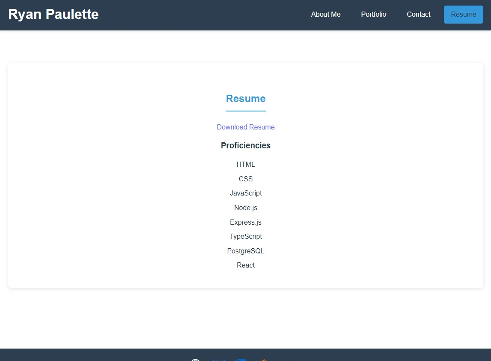

# My-Portfolio

https://paulettersportfolio.netlify.app

## Description
I created this portfolio page to give potential employers an easy and convenient way to learn about me and some of the projects I have accomplished. It also allows users to contact me with a message should they have questions or want to discuss anything further. Finally, it provides a link to download my resume to delve a bit deeper into my career and experience.

## Table of Contents
- [Installation](#installation)
- [Usage](#usage)
- [License](#license)
- [Contributing](#contributing)
- [Tests](#tests)
- [Questions](#questions)

## Installation
N/A

## Usage

Upon loading up the page you will be brought initially to the About Me section.   This section provides an image of myself as well as a brief description about me. When you're ready to explore simply click any of the links in the navigation bar at the top to the right of my name.

The Portfolio section provides access to some of the projects that I have worked on. You will see indivdual cards with a screenshot of the project, the title of the project, and a link to the deployed application as well as a link to that project's GitHub repository.

The Contact section provides a form for the user to fill out should they wish to reach out. Simply fill in all of the provided fields with the necessary information and click the submit button.

The Resume section provides a list of my proficiencies as well as a link to download my resume.

Should the user wish to learn anymore about me, they can click any of the logos at the bottom of the screen to check out my GitHub, LinkedIn, or Stack Overflow pages.

  ## License
    MIT
    
  https://opensource.org/licenses/MIT

## Contributing
At this time no further contributions are needed.

## Tests
N/A

## Questions
GitHub: [pauletters](https://github.com/pauletters)
Email: pauletters87@gmail.com
